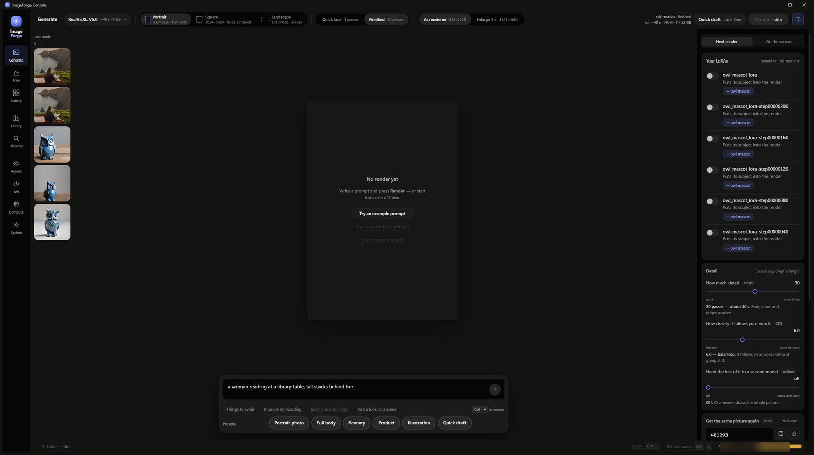
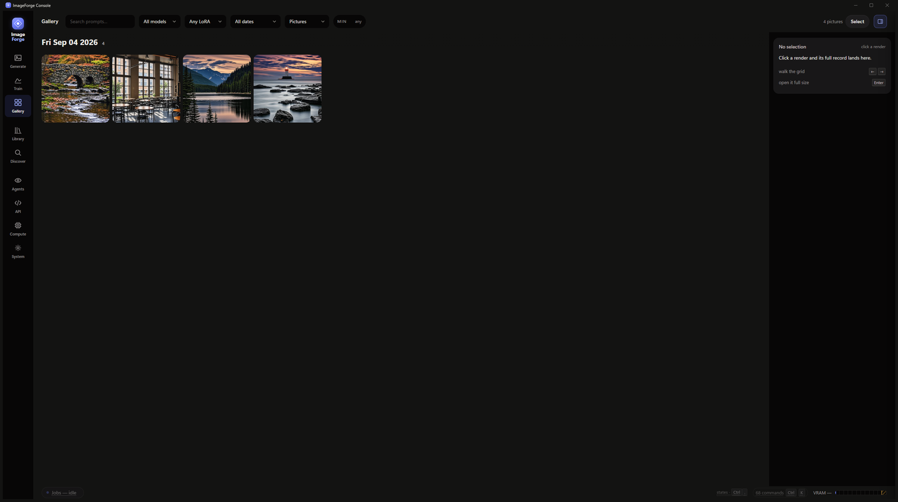
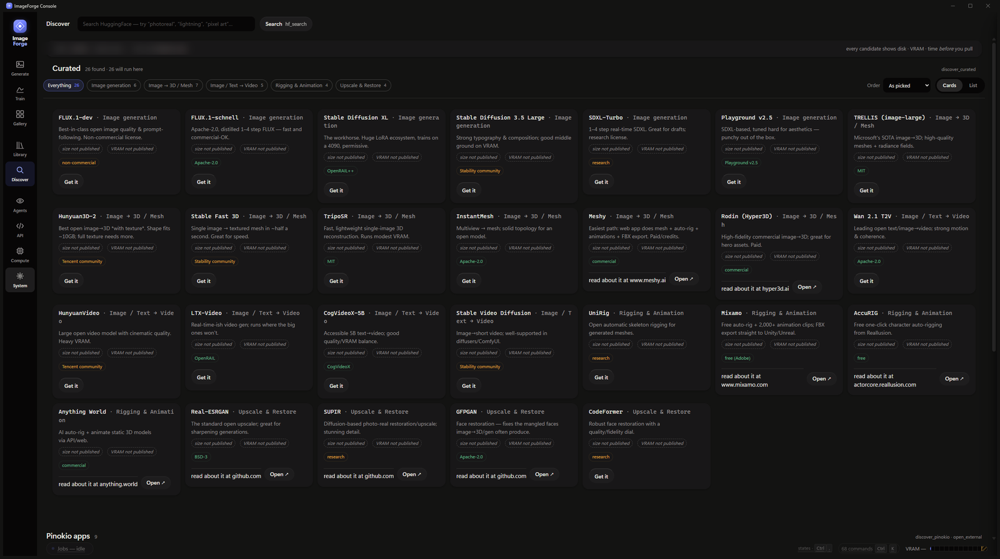
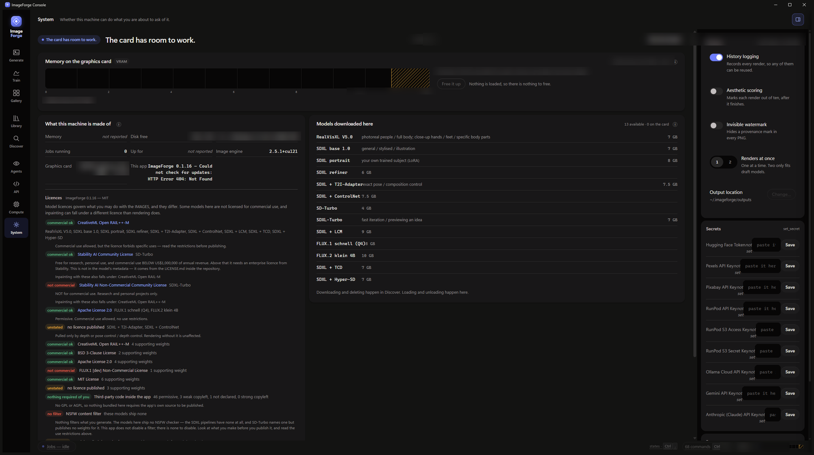

# ImageForge — the guide

Everything runs on your own computer. No account, no subscription, nothing
sent anywhere unless you ask for it.

| | |
|---|---|
| [First run](#first-run) | What happens after you install, and the 5 GB download |
| [Generate](#generate) | Making a picture, and what the controls actually do |
| [Choosing a model](#choosing-a-model) | Thirteen of them; which to use for what |
| [Gallery](#gallery) | Everything you have made, and the settings that made it |
| [Train](#train) | Teaching it your own subject or style |
| [Discover](#discover) | Getting more models |
| [Agents and the API](#agents-and-the-api) | Driving it from Claude, or from code |
| [System](#system) | The engine, licences, and what is allowed |
| [Where your files live](#where-your-files-live) | And what an uninstall does not touch |

---

## First run

The app is 47 MB. **The image engine is about 5 GB more, and it is not
included** — the right build depends on your graphics card, which an installer
cannot know in advance.

Open ImageForge, go to **System**, and it offers the engine. It says what it
will fetch and why: an NVIDIA card gets the accelerated build, anything else
gets the processor build with a warning that renders will be much slower. It
does not refuse either way.

On a mid-range NVIDIA card the install takes about five minutes.

Nothing else is required. No account, no API key, no administrator prompt.

---

## Generate

Type what you want and press **Render**. That is the whole minimum.

**The prompt box** takes plain description. "A red fox in snow, soft winter
light" works better than a list of keywords. The row underneath offers
*Things to avoid* (what not to draw), *Improve my wording*, and preset chips —
Portrait photo, Full body, Scenery, Product, Illustration — which set sensible
sizes and step counts for that kind of picture.

**Shape** — Portrait, Square, Landscape. Square is best for faces and product
shots; landscape for scenes.

**Quality** — *Quick look* is a draft; *Finished* takes longer and resolves
skin, fabric and edges. The button tells you roughly how long, measured for
your machine rather than guessed.

**Detail panel**, on the right:

- **How much detail (steps)** — more passes, more resolution of fine texture.
  Past a point it stops helping and only costs time.
- **How closely it follows your words (CFG)** — low lets it invent, high
  follows you literally and can go stiff. Around 6 is balanced.
- **Get the same picture again (seed)** — lock it to reproduce a render
  exactly, re-roll it for a different take on the same prompt.
- **Hand the last of it to a second model (refiner)** — an SDXL-only extra
  pass for final polish.

**The first render of a session is slow** — several seconds to half a minute —
because the model has to load into the graphics card. Every render after that
is much faster. The estimate shown accounts for both.

---

## Choosing a model

The picker names each model with what it is *for*, not just its name.

| If you want | Use | Why |
|---|---|---|
| A fast draft | **SD-Turbo** | Under a second warm, 512px |
| Photoreal people, full body, hands | **RealVisXL V5.0** | A photoreal SDXL fine-tune |
| General, stylised, illustration | **SDXL base 1.0** | Full quality at 1024px |
| Fast iteration at higher quality | **SDXL-Turbo** or **SDXL + LCM** | Few-step, good balance |
| The best quality available | **FLUX.1 schnell** | Slower, and needs headroom |
| Exact pose or composition | **SDXL + ControlNet** | Give it a reference structure |

**Check the licence before you sell anything you make.** They differ, and not
the way you would guess — see [System](#system).

---

## Gallery

Everything you have made, newest first, grouped by day. Click one and its full
record appears: the prompt, the model, the seed, the steps, the guidance —
everything needed to make it again.

Filter by model, by adapter, by date. Search your own prompts.

---

## Train

Teach the app a subject — a person, a pet, an object — or a style, by showing
it examples. The result is a **LoRA adapter**: a small file that plugs into an
existing model rather than a whole new model.

**Read this part first: ImageForge does not include the trainer.** It
prepares everything a training run needs — it imports your photos, captions
them for you, checks them for problems, and writes the configuration — and
then the run itself is performed by **kohya sd-scripts**, which is a separate
project you install yourself. If you have not installed it, the job finishes
with *"config written — no adapter was trained"* and tells you so. It does not
pretend to have made one.

What the app does for you:

1. Put 15–30 photos of the subject in a folder. Varied angles and lighting;
   consistent subject.
2. **Train** → point it at the folder. It captions every image, checks the
   set for problems (images too small, inconsistent aspect ratios) and says
   what it found.
3. Start the run. It writes the training config, the dataset layout and the
   sample prompts alongside your images.

What you do:

4. Install kohya sd-scripts into `~/sd-scripts`. With it present on an NVIDIA
   machine, step 3 launches the run instead of stopping at the config — it
   takes hours on a consumer card — and the adapter then appears in
   **Library** and in the Generate sidebar.

**Two honest warnings.** Training needs a lot of graphics memory and a lot of
time. And what you may do with the output depends on the images you trained
on — nobody publishes a licence for an adapter you made, so that judgement is
yours.

---

## Discover

A curated catalogue of models beyond the built-in thirteen — image generation,
image-to-3D, video, rigging, upscaling — each tagged with its licence and what
it is good at, plus a search across HuggingFace.

**Models pulled through Discover are not covered by the Licences panel.** That
panel describes the built-in catalogue. Anything you fetch here comes with its
own terms; check the model's own page.

---

## Agents and the API

ImageForge is also an **MCP server**, so Claude, Cursor or any MCP client can
generate images through it.

Open **Agents** and it prints the configuration to paste into your client. It
names the engine's own interpreter and a working directory, so it works as-is
once the engine is installed.

Seven tools are exposed:

| Tool | Does |
|---|---|
| `generate_image` | Text to image |
| `edit_image` | Image to image |
| `inpaint_image` | Replace part of an image |
| `assist_prompt` | Improve a prompt |
| `list_models` | The catalogue, **with each model's licence** |
| `rate_output` | Record a preference |
| `generation_insights` | What has worked so far |

`list_models` carries licences deliberately: an agent asked for something
commercial can see that SDXL-Turbo forbids it.

There is also an **HTTP API** on `127.0.0.1:8765` with the same engine behind
it. The **API** screen shows ready-made `curl` and Python snippets and can
create a key.

Both are local only. Nothing listens on the network.

> **A note on keys.** Naming a file on disk in an API request requires the
> local key, even when keys are otherwise optional — otherwise any other
> program on your computer could ask ImageForge to read your images. Sending
> an image as base64 needs no key.

> **A note on folders.** The MCP tools that take a file path — editing,
> inpainting, a reference or control image — will only open images inside
> ImageForge's own outputs, datasets and cache folders. An agent's
> instructions can come from whatever it last read, so the thing choosing
> that path may not be you. To let it work on photos kept elsewhere, set
> `IMAGEFORGE_IMAGE_DIRS` to those folders — point it at a pictures
> folder, not at your whole home directory.

---

## System

*The blurred patches are the readings that differ from machine to machine — the graphics card, its memory, the Windows build, free disk. Everything else on this screen is identical for everyone who downloads it.*

Four things live here.

**The engine** — install it, see its version, remove it.

**Run the checks** — fourteen of them: graphics card, CUDA, disk, dependencies,
optional keys. They report consequences rather than demands: *"No HF_TOKEN —
gated models cannot be pulled"*, not "missing required token".

**Licences** — what you may do with the pictures. The app is MIT; the models
are not, and they differ:

| Model | Commercial use |
|---|---|
| **SD-Turbo** (the default) | Yes — **below US$1,000,000 annual revenue** |
| **SDXL-Turbo** | **No.** Research and personal only |
| SDXL family, RealVisXL | Yes, with use restrictions |
| FLUX.1 schnell, FLUX.2 klein | Yes, unrestricted |

It also says when a *feature* pulls extra weights on their own terms —
inpainting and depth control both do — and it is honest about what it cannot
cover: models from Discover, and adapters you trained.

**There is no content filter.** The models here ship none: the SDXL pipelines
have no safety checker at all, and SD-Turbo names one but publishes no weights
for it. Nothing filters what you make. Look at it before you publish it, and
read the use restrictions your model's licence carries.

**Secrets** — optional keys for gated models (HuggingFace) or cloud rendering
(RunPod). Neither is needed to use the app.

---

## Where your files live

| | |
|---|---|
| Your renders | `%LOCALAPPDATA%\ImageForge\outputs` |
| The engine | `%LOCALAPPDATA%\ImageForge\runtime` (~5 GB) |
| Model weights | `%USERPROFILE%\.cache\huggingface` — **this gets large** |
| Settings and keys | `%USERPROFILE%\.imageforge` |
| The app itself | wherever you installed it |

**Uninstalling removes the app and nothing else.** Your renders stay, the
engine stays, the models stay — so reinstalling does not mean downloading five
gigabytes again. If you want the engine gone, remove it from the System screen
first, and the model cache is yours to delete whenever you like.

---

## Updating

**System** shows whether a newer version exists and offers to install it. It
downloads the installer, checks it against the hash published with the
release, and refuses if they disagree. The app closes while the installer
replaces it.

Or download it yourself: every release publishes a `latest.json` with the
SHA-256, so you can verify anything you fetch.
